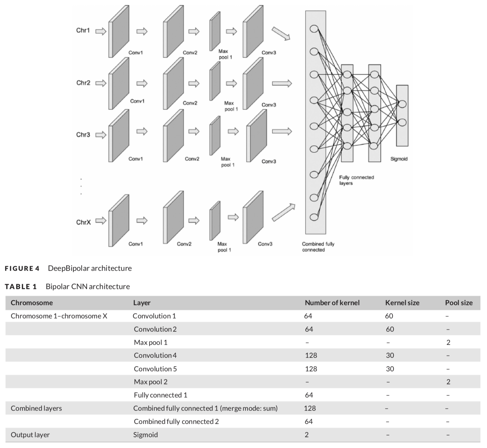
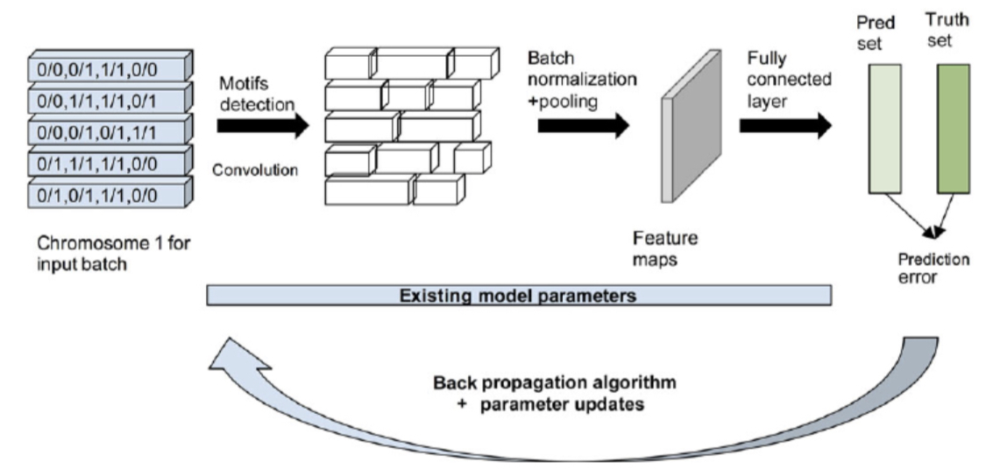
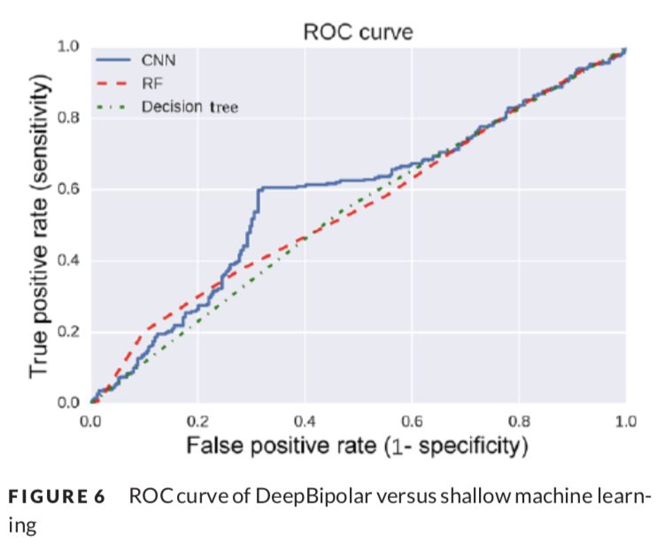
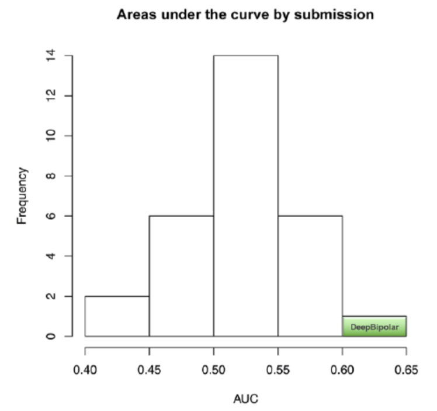

# **DeepBipolar**: Identifying genomic mutations for bipolar disorder via deep learning

## Background

---

DeepBipolar was the solution to the 2017 [“Bipolar Exomes” challenge](http://www.genomeinterpretation.org/cagi4-bipolar.html) conducted by the [Critical Assessment of Genome Interpretation 4](http://www.genomeinterpretation.org/cagi4-challenge.html). Proposed by the NSF Centre for Big Learning at the University of Florida, DeepBipolar was the most successful model submitted to the challenge, as per the assessments of the official assessors.

## Problem Statement

---

Based on the dataset provided by the organisers, the Bipolar Exomes challenge involved identifying and distinguishing individuals who were affected by bipolar disorder from the unaffected. Within the realm of machine learning, this constituted a “supervised classification” learning problem.  

  
## My Contributions
---

Over the course of the efforts, I worked on:

* Researching, designing, implementing, and testing the two following traditional machine learning (ML) models to establish the baseline:
  * Random Forests
  * Decision Trees 

* Architecting the entire machine learning pipeline:
  * data preprocessing 
  * feature engineering 
  * model training & testing
  * model evaluation

* Conducting model hyperparameter experiments to understand the best hyperparameters that exhibited the best model performance

* Testing & plotting different performance metrics to differentiate DeepBipolar from the traditional ML approach
  * Precision-Recall
  * AUC-ROC Curves 

* Authoring the entire DeepBipolar paper based on in-depth collaboration with my teammates to understand the proposed solution and all the technical details of the model

* Iteratively improving the overall quality of the research paper by frequently collecting and incorporating feedback from my lab supervisor and teammates.

 

  

  

## Impact

* DeepBipolar was awarded as the most successful solution to the Bipolar Exomes challenge.

* The DeepBipolar research paper was successfully published in the prestigious Human Mutation journal, therefore contributing to the medical community at large.

* The DeepBipolar paper, as a research publication, is permanently publicly available (online) within the prestigious National Library of Medicine and Wiley publications.

* The DeepBipolar paper currently enjoys 26 citations (Google Scholar) and 20 citations (Wiley Publications), cited by several medical research teams!

## Project Links

- Link to the Paper: [DeepBipolar](https://www.ncbi.nlm.nih.gov/pmc/articles/PMC5656045/)

- How to cite this article:

**PubMed**

> Sundaram L, Bhat RR, Viswanath V, Li X. DeepBipolar: Identifying genomic mutations for bipolar disorder via deep learning. Hum Mutat. 2017 Sep;38(9):1217-1224. doi: 10.1002/humu.23272. Epub 2017 Aug 1. Erratum in: Hum Mutat. 2018 Sep;39(9):1299. PMID: 28600868; PMCID: PMC5656045.

**Wiley**

> Laksshman S, Bhat RR, Viswanath V, Li X. DeepBipolar: Identifying genomic mutations for bipolar disorder via deep learning. Human Mutation. 2017;38,1217-1224. https://doi.org/10.1002/humu.23272
