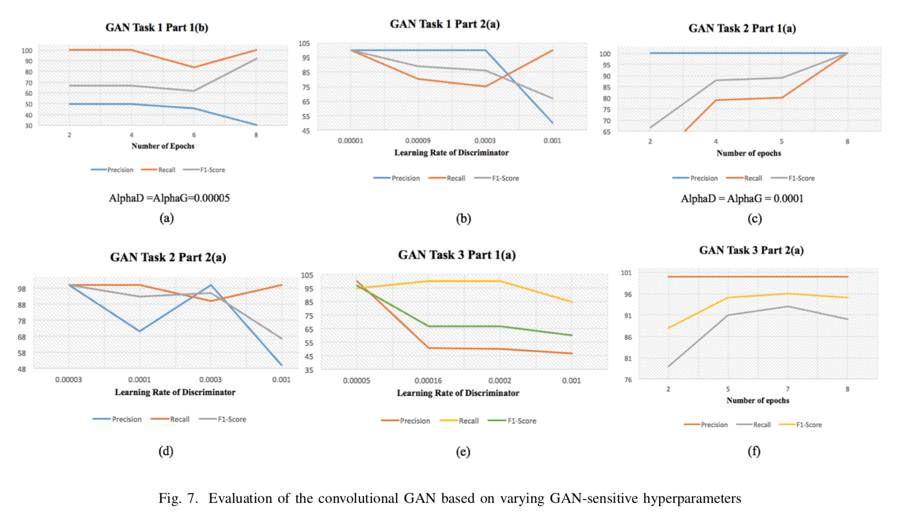

# **DeepCancer**: Detecting Cancer via Deep Generative Learning Through Gene Expressions

## Background

DeepCancer was the outcome of an investigative study focused on understanding the effectiveness of [generative adversarial networks (GANs)](https://en.wikipedia.org/wiki/Generative_adversarial_network) and deep [convolutional neural networks](https://en.wikipedia.org/wiki/Convolutional_neural_network) in the bioinformatics domain.

## Problem Statement

Using the microarray breast cancer data publicly available in the [NCBI Gene Expression Omnibus](https://www.ncbi.nlm.nih.gov/geo/) repository, the aim of DeepCancer was to accurately diagnose inflammatory breast cancer in a given patient. The novel approach involved using the [deep convolutional GAN (DCGAN)](https://arxiv.org/abs/1511.06434) architecture for this diagnosis. 

  
## My Contributions

Over the course of the efforts, I worked on:

* Researching, implementing, and testing the baseline Logistic Regression and Support Vector Machine models using traditional machine learning (ML) techniques.

* Architecting the machine learning pipeline from data preprocessing, feature engineering, model training & testing, to model evaluation.

* Conducting experiments on 4 different hyperparameters across the two models to discover the best hyperparameters that exhibited the best performance.

* Measuring and plotting different performance metrics like Precision-Recall, F1-Score, and the standard Confusion Matrix to differentiate DeepCancer from the traditional ML approach.

* Authoring the entire DeepCancer paper based on in-depth collaboration with my co-author for understanding the novel proposed solution and all the technical details of the model.

* Iteratively improving the overall quality of the research paper by frequently collecting and incorporating feedback from my lab supervisor, co-author

* Collaborating with the peer reviewers of the journal and communicating all the incorporated feedback and suggestions.

  

  

## Impact

* The DeepCancer paper was successfully accepted in the 2017 IEEE 3rd International Conference on Big Data Intelligence and Computing

* The DeepCancer paper was successfully published in the prestigious IEEE journal, therefore contributing to the medical community at large.

* The DeepCancer paper, as a research publication, is permanently publicly available (online) within the prestigious IEEE Xplore Conference Chapters

* The DeepCancer paper currently enjoys 2 citations, as per the IEEE website, cited by 2 different medical research teams!

## Project Links

- Link to the Paper: [DeepCancer](https://ieeexplore.ieee.org/abstract/document/8328496)

- How to cite this article:

**Chicago**

> Bhat, Rajendra Rana, Vivek Viswanath, and Xiaolin Li. "DeepCancer: detecting cancer via deep generative learning through gene expressions." In 2017 IEEE 15th Intl Conf on Dependable, Autonomic and Secure Computing, 15th Intl Conf on Pervasive Intelligence and Computing, 3rd Intl Conf on Big Data Intelligence and Computing and Cyber Science and Technology Congress (DASC/PiCom/DataCom/CyberSciTech), pp. 901-908. IEEE, 2017.