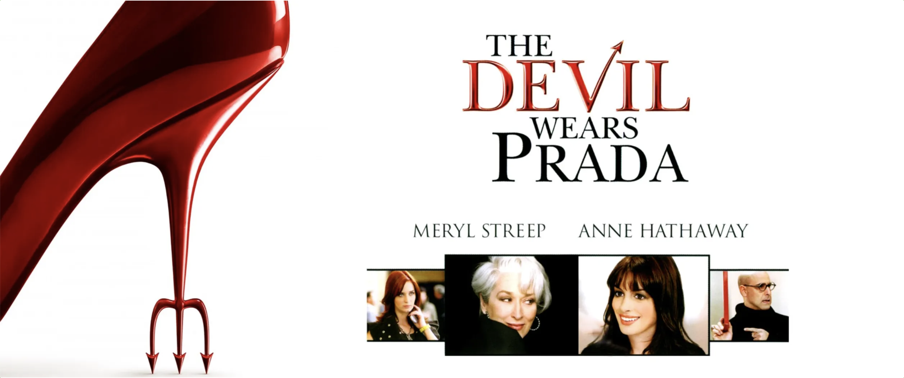

# **Movie Review: The Devil Wears Prada**

## Background

I love movies! It is genuinely fascinating to see how multiple creative minds come together to give shape to their collective vision and narrate a story, regardless of its genre. Besides, over the years, my lived experiences across multiple countries, I can now appreciate the beauty in nuance. In other words, I can appreciate the minutiae of moviemaking, especially the cinematography, screenplay, and above all, background score. This motivated me to analyse movies that I've loved in the past or ones that recently captivated me in one way or another. _The Devil Wears Prada_ is one such movie that I always found intriguing, since it's based on the fashion industry - something that's quite far removed from my work experience.

## My Contributions

Well, I wrote the entire article :P

Also, I write for the Medium publication Story Lamp Reviews that invites writers to write about movies, books, recommendation lists, and any engaging & thoughtful commentary on film, literature, or storytelling in general.

## Impact

* This is my love for movies manifesting itself. So, I'm not seeking any real impact.

* On Medium, the article currently enjoys 143 claps/likes! (So, some people definitely loved it, haha!)

## Project Links

- Link to the article: [The Devil Wears Prada](https://medium.com/story-lamp-reviews/the-devil-wears-prada-fa4cd7a3aa81)
