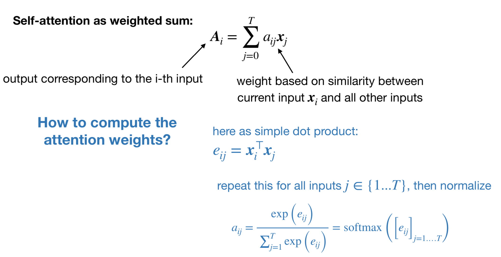
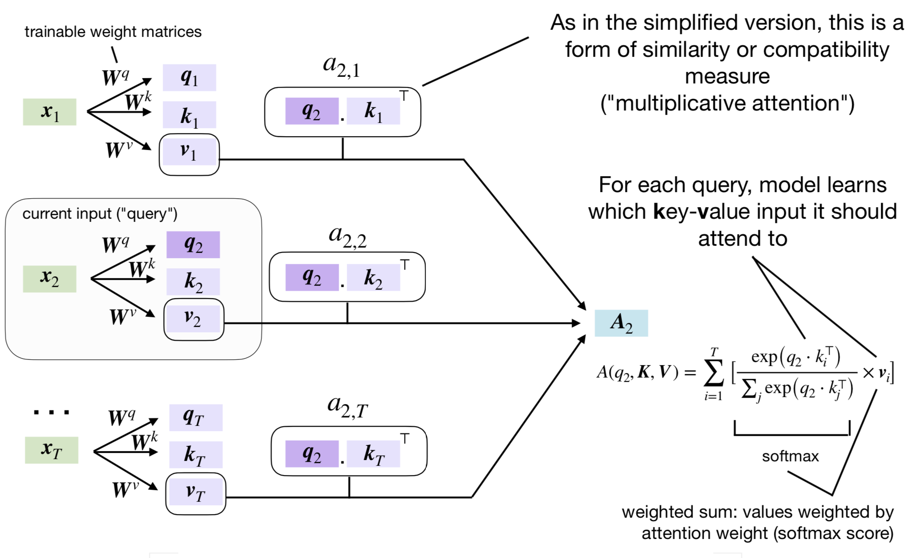
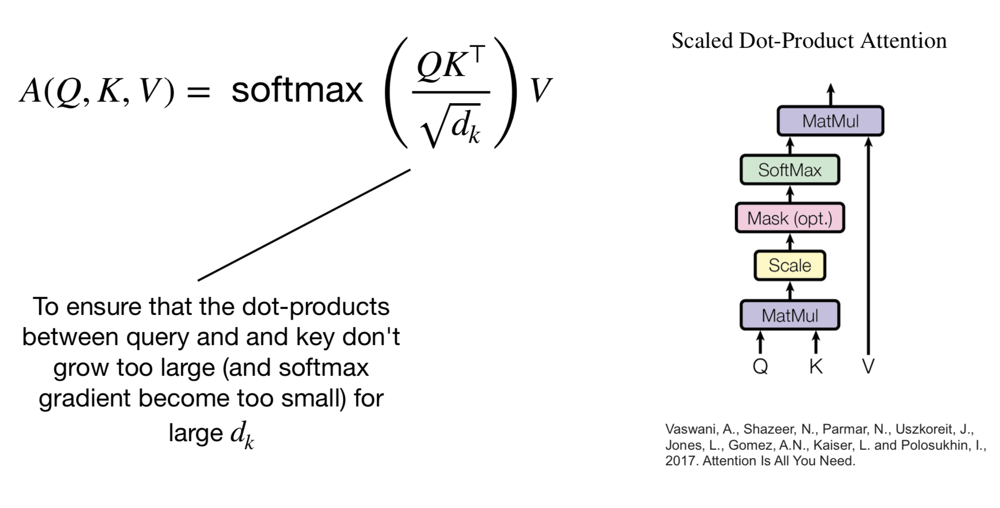
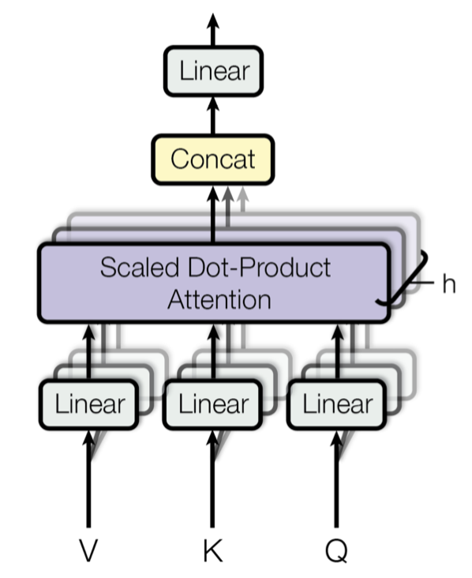
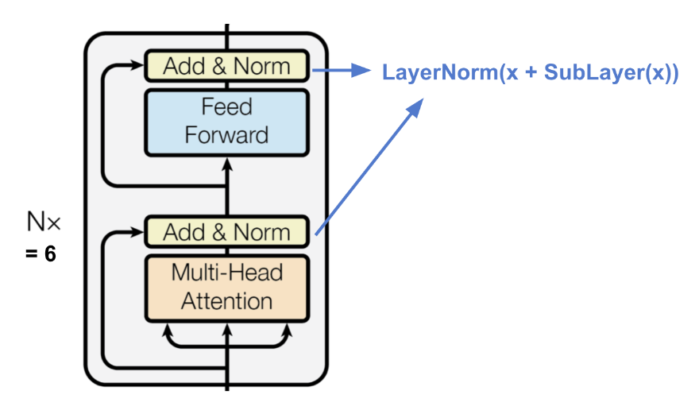
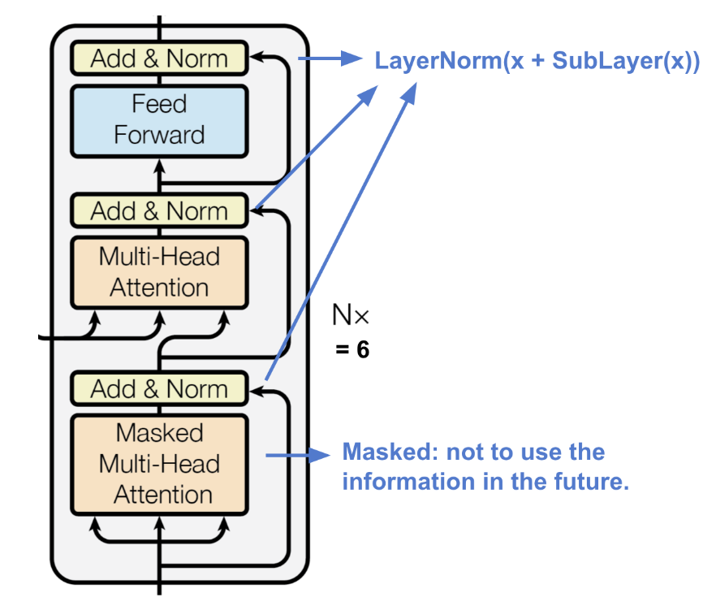
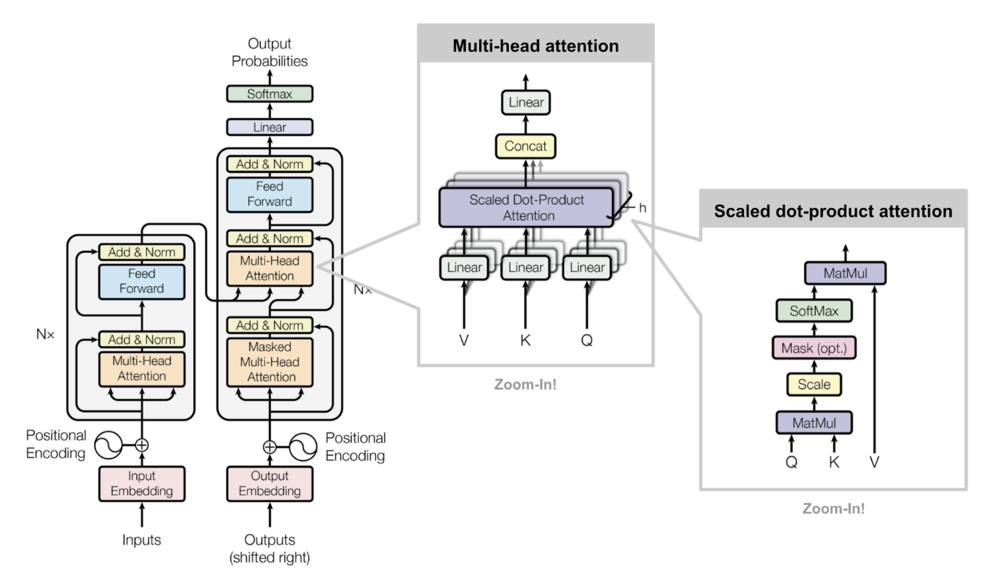

# Important Concepts

## Table of Contents

| Topics | Links |
| :-----:| :-----:| 
| Overview| [Overview](#overview) |
| Prerequisites | [Prerequisites](#prerequisites) |
| Revisiting Attention Models| [Revisiting Attention Models](#revisiting-attention-models) | 
| The Transformer Model | [Transformers](#the-transformer) |
| How Do Transformers Work | [How Transformers Work](#how-do-transformers-work) |

## Overview

This page provides detailed information about all the concepts related to Transformers that are important for understanding and using Transformers for different real-world natural language processing (NLP)applications such as text classification or machine translation.

> ✅ **NOTE**  
> 1. If you already understand the basics of Transformers and just want to implement your first Transformer model in code and run it, see [Transformers: Getting Started](Getting%20Started.md) instead.
> 2. If you already understand the theoretical concepts behind Transformers and are trying to understand how to use them for certain applications, you might want to check [How To Use Transformers for Translation](How%20to%20use%20Transformers%20for%20Translation.md) instead.

### Scope

This page aims to answer the following questions about the Transformer model in detail:

- What is the Transformer model?
- Which theoretical concepts are Transformers based on?
- Why is it more successful than traditional sequence-to-sequence (seq2seq) deep learning models?
- How does the theoretical deisgn of the Transformer model ensure improved learning, in comparison to traditional deep recurrent neural networks?

### Target Audience

This documentation is meant for readers interested in/working on:
- understanding how attention models work
- understanding the underlying mathematics underpinning attention models
- understanding how attention models can be implemented
- novel solutions to natural language processing tasks
- latest deep learning research ideas

## Prerequisites

This documentation assumes:

- you already have a background in machine learning and deep learning 
- you understand the mathematical basics of deep neural networks, especially:
  - linear algebra
  - differential calculus
- you understand how recurrent neural networks work
- you understand the basics of Natural Language Processing like 
- you have prior knowledge about seq2seq models
- you understand the basics of the attention mechanism
- you have prior experience with computer programming in Python
- you have prior experience with deep learning libraries such as Keras and TensorFlow

## Revisiting Attention Models

> ✅ **NOTE**  
> - This section assumes you already understand the basics of the attention mechanism. If you don't, see [The Attention Guide](https://machinelearningmastery.com/the-attention-mechanism-from-scratch/).
> - This section assumes you already satisfy all the [Prerequisites](#prerequisites).

This section will briefly revisit the main concepts behind the attention mechanism and serve as a gateway for you to understand the Transformer model.

### ***Sequence-to-Sequence Models***

> Figure 1: The encoder-decoder model. The visualization of both encoder and decoder is unrolled in time.

The [seq2seq](https://arxiv.org/abs/1409.3215) model has origins in language modeling. Formally, the model transforms an input sequence (source) to a new sequence (target), possibly having an arbitrary length. Such transformation tasks are commonplace in machine translation between different languages, either in text, audio, or question-answer dialog, to name a few.

The seq2seq model normally has an encoder-decoder architecture (Figure 1), comprising:

- The encoder processes the input sequence and encodes the information into a context vector (also called a sentence embedding or “thought” vector) of a fixed length. This representation captures a good summary of the meaning of the whole source sequence.
- The decoder is initialized with the context vector to emit the transformed output. 
- Previous works used only the last state of the encoder as the decoder initial state.
- Both the encoder and decoder are recurrent neural networks (LSTM or GRU units).

### ***Disadvantage of seq2seq models***

A critical disadvantage of this fixed-length context vector design is the inherent incapability of the model to remember long sentences. In other words, the model forgets the initial input parts, once it completes processing the whole input. The [Attention mechanism](https://arxiv.org/pdf/1409.0473.pdf) resolves this problem.

### ***Attention for Translation***

The attention mechanism essentially memorizes long source sentences in [neural machine translation (NMT)](https://arxiv.org/pdf/1409.0473.pdf). Unlike the seq2seq model, at each time step, the attention model looks into the source sentence and tries to determine the relevance of the input word to different words in the target sentence. It then determines this relevance by assigning attention weights, thereby mitigating the "forgetting" that seq2seq models exhibit. The alignment between the source and target is learned and controlled by this "context" vector. 

As Figure 2 shows, the context vector essentially comprises:

- encoder hidden states;
- decoder hidden states;
- alignment between source and target.

> Figure 2: The encoder-decoder model with additive attention mechanism.

The encoder is a bidirectional RNN with forward and hidden states that are concatenated to yield the encoder state. The motivation is to include both the preceding and following words in the annotation of one word. The decoder network has hidden state **s** for the output word at position t, t=1,...,_m_, where the context vector **c** is a sum of hidden states of the input sequence, weighted by alignment scores, as follows:

The alignment model assigns a score to the pair of input at position i and output at position t, based on how well they match. The set of $\alpha$(_t_,_i_) are weights defining how much of each source hidden state should be considered for each output. In Bahdanau’s paper, the alignment score is obtained using a feed-forward neural network with a single hidden layer, trained jointly with other parts of the model. Using tanh as the non-linear activation function, the score function, therefore, becomes:

where both **v** and **W** are weight matrices to be learned in the alignment model.

> Figure 3 Alignment matrix of "L'accord sur l'Espace économique européen a été signé en août 1992" (French) and its English translation "The agreement on the European Economic Area was signed in August 1992". 

## The Transformer 

The [Transformer model](http://papers.nips.cc/paper/7181-attention-is-all-you-need.pdf), is perhaps the most impactful paper since 2017. It affored seq2seq modeling without using recurrent network units. This is because Transformers are built entirely on the [self-attention mechanism](#self-attention-without-rnns) without using sequence-aligned recurrent architecture. 

In the following sections, we will look at the critical building blocks that constitute the Transformer architecture.

### ***Self-Attention***

Self-attention establishes associations between different positions of a single sequence to compute a representation of the same sequence.

There are 3 critical steps in self-attention:
1) Derive attention weights: similarity between current input and all other inputs, as shown in Figure 4
2) Normalize weights via softmax, as shown in Figure 4
3) Compute attention value from normalized weights and corresponding inputs, as shown in Figure 5

> Figure 4: **self-attention** derived as a weighted sum

> Figure 5: The Self-Attention Mechanism

### ***Self-Attention without RNNs***

A key point to note in the basic form of [Self-Attention](#self-attention) we saw in the previous section is that the basic version did not involve any learnable parameters. Therefore, it is not very useful for learning a language model.

We, therefore, add 3 trainable weight matrices that are multiplied with the input sequence embeddings:

- query = **Wqx_i_**
- key = **Wkx_i_**
- value = **Wvx_i_**

Here, the encoded representation of the input are viewed as a set of key-value pairs, (**K**, **V**), having dimensions _dk_ and _dv_ (input sequence length). Both the keys and values are the encoder hidden states. In the decoder, the previous output is compressed into a query **Q** (of dimension _dq_) and the next output is produced by mapping this query and the set of keys and values. In other words,

- **_dq_** = **_dk_**, and 
- **_dq_** = **_dv_**
- where embeddings _de_ = _dmodel_ = 512.

The output is a weighted sum of the values, where the weight assigned to each value is determined by the dot-product of the query with all the keys, as shown below in Figure 6:

> Figure 6: The Softmax Weighted Scoring mechanism

In the original [Transformer paper](http://papers.nips.cc/paper/7181-attention-is-all-you-need.pdf), the Transformer adopts the scaled dot-product attention instead: 

### ***Multi-Head Attention***

The core idea behind multi-head attention simply extends the self-attention mechanism we learnt in the [Self-Attention Without RNNs](#self-attention-without-rnns) section:

- We apply self-attention multiple times in parallel (similar to multiple kernels for channels in [Convolutional Neural Networks](https://cs231n.github.io/convolutional-networks/)).
- For each head (self-attention layer), we use different trainable weight matrices **Wk**, **Wv**, **Wq** for each (**K**, **V**, **Q**) pair, and then concatenate the resultant attention terms, **Ai**.
- The original paper uses 8 attention heads **Wq(1)**, **Wk(1)**, **Wv(1)**, ..., **Wq(8)**, **Wk(8)**, **Wv(8)**
- Multi-head attention allows attending to different parts in the sequence differently

## How Do Transformers Work?

Now that we have seen all the building blocks of the Transformer model, we will see how the Transformer leverages all these blocks to function effectively.

### ***Encoder***

The encoder generates an attention-based representation with capability to locate a specific piece of information from a potentially infinitely-large context.

- A stack of N=6 identical layers.
- Each layer has a multi-head self-attention layer and a simple position-wise fully connected feed-forward network.
- Each sub-layer adopts a residual connection and layer normalization.
- All the sub-layers output data of the same dimension _dmodel_ = 512.

### ***Decoder***

The decoder is able to retrieval from the encoded representation.

- A stack of N = 6 identical layers
- Each layer has two sub-layers of multi-head attention layers and one sub-layer of fully-connected feed-forward network.
- Similar to the encoder, each sub-layer adopts a residual connection and layer normalization.
- The first multi-head attention sub-layer is modified to prevent positions from attending to subsequent positions, as we don’t want to look into the future of the target sequence when predicting the current position.

> ✅ **NOTE**  
> **An Implementation quirk: Causal Padding!**

> An additional detail that needs to be taken into account: _causal padding_. 
>
>Causal padding is absolutely critical to successfully training a seq2seq Transformer. Unlike an RNN, which looks at its input one step at a time, and thus will only have access to steps 0...N to generate output step N (which is token N+1 in the target sequence), the `TransformerDecoder` is order-agnostic, i.e., it looks at the entire target sequence at once. 
>
>If it were allowed to use its entire input, it would simply learn to copy input step N+1 to location N in the output. The model would, thus, achieve perfect training accuracy, but of course, when running inference, it would be completely useless, since input steps beyond N aren’t available.
>
>This can be addressed by masking the upper half of the pairwise attention matrix to prevent the model from paying any attention to information from the future—only information from tokens 0...N in the target sequence should be used when generating target token N+1. This is done in the Transformer Decoder to retrieve an attention mask that can be passed to the Multi-Head Attention layers.

### ***Full Architecture***

> Figure 7 The Transformer architecture

Finally, here is the complete view of the Transformer’s architecture:

- Both the source and target sequences first go through embedding layers to produce data of the same dimension _dmodel_ = 512.
- To preserve the position information, a sinusoid-wave-based positional encoding is applied and summed with the embedding output. Sinusoidal positional encoding is a vector of small values (constants) added to the embeddings. As a result, the same word will have slightly different embeddings depending on where they occur in the sentence.
- A softmax and linear layer are added to the final decoder output.

### ***Why Transformers Succeed***

Transformers succeed mainly because of two key reasons:

1. The self-attention mechanism allows encoding long-range dependencies.
2. The inherent self-supervision of the architecture allows leveraging large unlabeled datasets, which spans most real-world datasets.