# Important Concepts

## Table of Contents

| Topics | Links |
| :-----:| :-----:| 
| Overview| [Overview](#overview) |
| Revisiting Attention Models| [Revisiting Attention Models](#revisiting-attention-models) | 
| The Transformer Model | [Transformers](#the-transformer) |
| How Do Transformers Work | [How Transformers Work](#how-do-transformers-work) |

## Overview

This page provides detailed information about all the concepts related to Transformers that are important for understanding and using Transformers for different real-world natural language processing (NLP) applications such as text classification or machine translation.

> ✅ **NOTE**
> 1. If you already understand the basics of Transformers and just want to implement your first Transformer model in code and run it, see [Transformers: Getting Started](getting-started.md) instead.
> 2. If you already understand the theoretical concepts behind Transformers and are trying to understand how to use them for certain applications, see [How To Use Transformers for Translation](how-to-use-transformers-for-translation.md) as an example instead.

### Scope

This page answers the following questions about the Transformer model:

- What is the Transformer model?

- Which theoretical concepts are Transformers based on?

- Why is the Transformer model more successful than traditional sequence-to-sequence (seq2seq) deep learning models?

- How does the theoretical deisgn of the Transformer model ensure improved learning, in comparison to traditional deep recurrent neural networks?

## Revisiting attention models

This section will briefly revisit the main concepts behind the attention mechanism and serve as a gateway for you to understand the Transformer model.

### Sequence-to-Sequence models

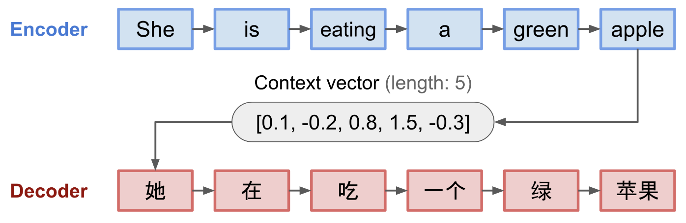
> Figure 1: The encoder-decoder model. The visualization of both encoder and decoder is unrolled in time.

The [seq2seq](https://arxiv.org/abs/1409.3215) model has origins in language modeling. Formally, the model transforms an input source sequence to a new target sequence, possibly of different lengths. Such transformation tasks are commonplace in machine translation scenarios involving different languages, either in text, audio, or question-answer dialog, and more.

As shown in Figure 1, a seq2seq model comprises an encoder-decoder architecture:

- The encoder processes the input sequence and encodes the information into a context or thought vector of a fixed length. This vector captures a good summary of the meaning of the whole input sequence.

- The decoder is initialized with the context vector to emit the transformed output. 

- Both the encoder and decoder are recurrent neural networks (LSTM or GRU units).

However, such a fixed-length context vector design is inherently unsuitable for remembering long sentences, wherein the model forgets the initial input parts once it completes processing the input sentence. The [Attention mechanism](https://arxiv.org/pdf/1409.0473.pdf) resolves this problem.

### Attention for translation

In [neural machine translation (NMT)](https://arxiv.org/pdf/1409.0473.pdf) tasks, unlike the seq2seq model, at each time step, the attention model looks into the source sentence and tries to determine the relevance of the input word to different words in the target sentence by assigning attention weights, reducing the "forgetting" problem. The alignment between the source and target is learned and controlled by this context vector.

As shown in Figure 2, the context vector contains:

- encoder hidden states
- decoder hidden states
- alignment between source and target.

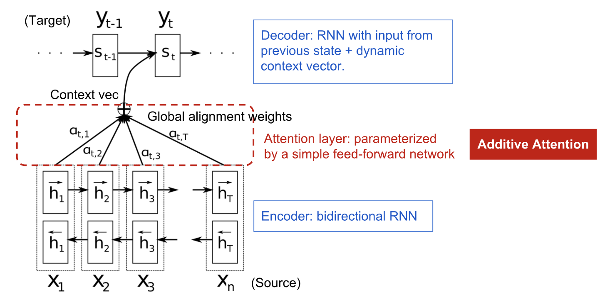
> Figure 2: The encoder-decoder model with additive attention mechanism.

Here, the encoder is a bidirectional recurrent neural network (RNN) with forward and hidden states that are concatenated to yield the encoder state. Here, both the preceding and following words in the annotation of one word are included. The decoder network has hidden state `s` for the output word at position t, t=1,...,_m_, where the context vector `c` is a sum of hidden states of the input sequence, weighted by alignment scores:

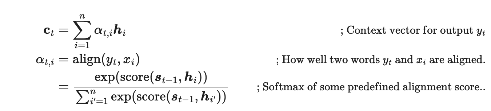

The alignment model assigns a score to the pair of input at position `i` and output at position `t`, based on how well they match. The set of $\alpha$(_t_,_i_) are weights defining how much of each source hidden state should be considered for each output. In the original paper, the alignment score is obtained using a feed-forward neural network with a single hidden layer, trained jointly with other parts of the model. Using tanh as the non-linear activation function, the score function, therefore, becomes:

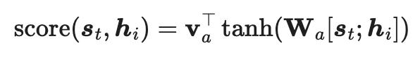

where both `v` and `W` are weight matrices to be learned in the alignment model.

> Figure 3 Alignment matrix of "L'accord sur l'Espace économique européen a été signé en août 1992" (French) and its English translation "The agreement on the European Economic Area was signed in August 1992".

## The Transformer 

The [Transformer model](http://papers.nips.cc/paper/7181-attention-is-all-you-need.pdf) was published in 2017 by researchers at Google and the University of Toronto, Canada. It enabled seq2seq modeling without using recurrent network units, since the Transformer model is built on the [self-attention mechanism](#self-attention-without-rnns) without using sequence-aligned recurrent units. 

In the following sections, we will look at the critical building blocks that constitute the Transformer architecture.

### Self-attention

Self-attention establishes associations between different positions of a single sequence to compute a representation of the same sequence.

There are 3 critical steps in self-attention:

1) Derive attention weights: similarity between current input and all other inputs, as shown in Figure 4.

2) Normalize weights via softmax, as shown in Figure 4.

3) Compute attention value from normalized weights and corresponding inputs, as shown in Figure 5.

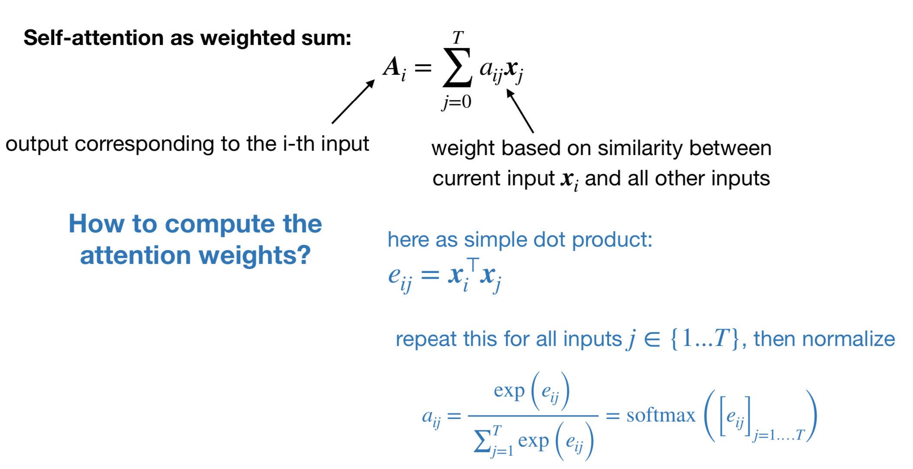
> Figure 4: **self-attention** derived as a weighted sum

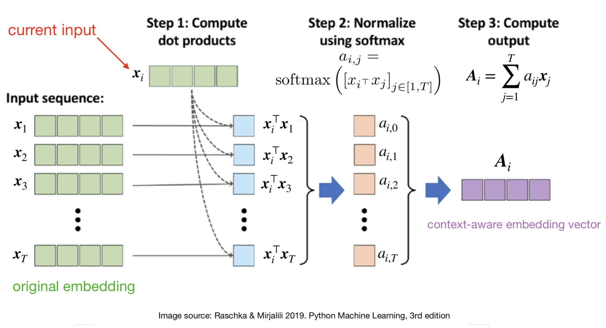
> Figure 5: The Self-Attention Mechanism

### Self-attention without RNNs

A key aspect of self-attention above is that it didn't involve any learnable parameters. Therefore, as per the original paper, there are 3 trainable weight matrices that are multiplied with the input sequence embeddings:

- query = **Wqx_i_**
- key = **Wkx_i_**
- value = **Wvx_i_**

Here, the encoded representation of the input is viewed as a set of key-value pairs, (**K**, **V**), having dimensions _dk_ and _dv_ (input sequence length). Both the keys and values are the encoder hidden states. In the decoder, the previous output is compressed into a query **Q** (of dimension _dq_) and the next output is produced by mapping this query and the set of keys and values:

- **_dq_** = **_dk_**, and 
- **_dq_** = **_dv_**
- where embeddings _de_ = _dmodel_ = 512.

The output is a weighted sum of the values, where the weight assigned to each value is determined by the dot-product of the query with all the keys, as shown in Figure 6:

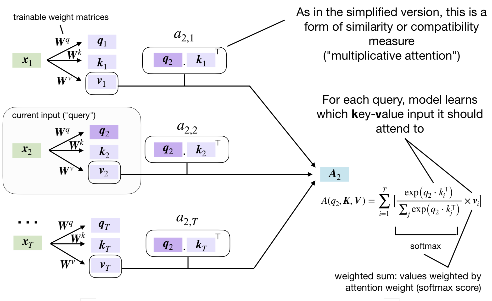
> Figure 6: The Softmax Weighted Scoring mechanism

In the original [Transformer paper](http://papers.nips.cc/paper/7181-attention-is-all-you-need.pdf), the Transformer adopts the scaled dot-product attention instead: 

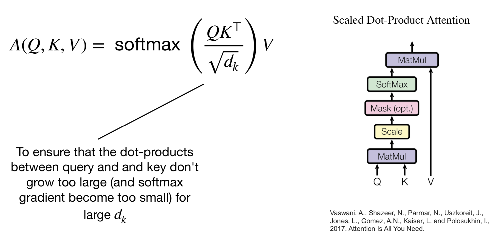

### Multi-head attention

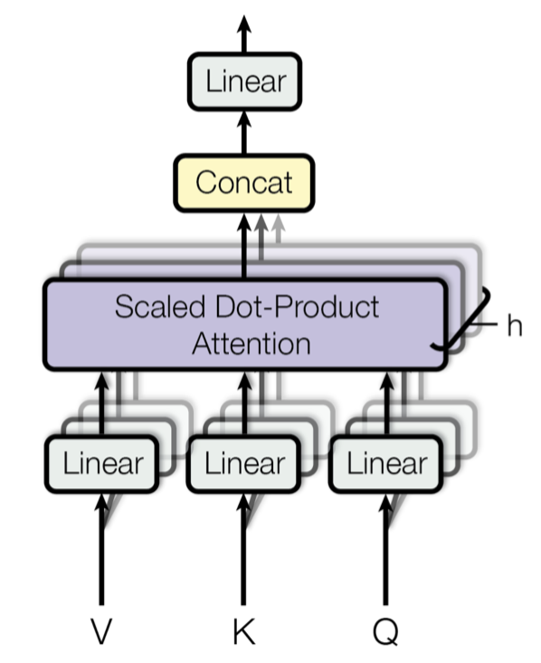

The core idea behind multi-head attention simply extends the self-attention mechanism explained in the [Self-Attention Without RNNs](#self-attention-without-rnns) section above:

- Self-attention is applied multiple times in parallel (similar to multiple kernels for channels in [Convolutional Neural Networks](https://cs231n.github.io/convolutional-networks/)).

- For each head (self-attention layer), different trainable weight matrices **Wk**, **Wv**, **Wq** are used for each (**K**, **V**, **Q**) pair, followed by a concatenation of the resultant attention terms, **Ai**.

- The original paper uses 8 attention heads **Wq(1)**, **Wk(1)**, **Wv(1)**, ..., **Wq(8)**, **Wk(8)**, **Wv(8)**

- Multi-head attention allows attending to different parts in the sequence differently.

## How do Transformers work?

### Encoder

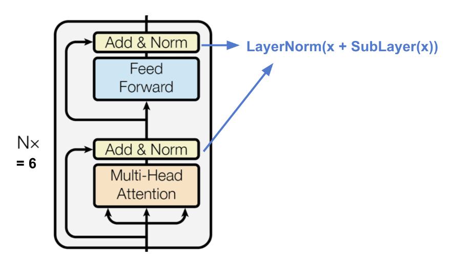

The encoder generates an attention-based representation to locate a specific word from a potentially large context.

- A stack of N=6 identical layers.

- Each layer has a multi-head self-attention layer and a simple position-wise fully connected feed-forward network.

- Each sub-layer adopts a residual connection and layer normalization.

- All the sub-layers output data of the same dimension _dmodel_ = 512.

### Decoder

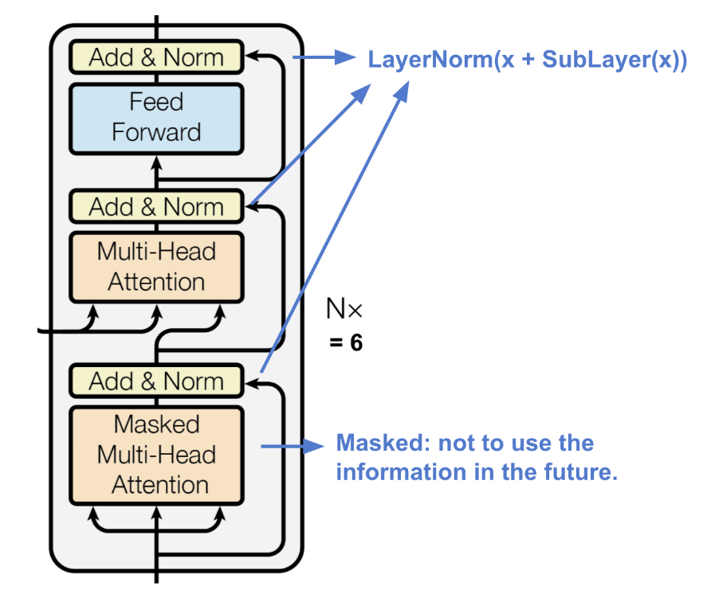

The decoder is able to retrieval from the encoded representation.

- A stack of N = 6 identical layers

- Each layer has two sub-layers of multi-head attention layers and one sub-layer of fully-connected feed-forward network.

- Similar to the encoder, each sub-layer adopts a residual connection and layer normalization.

- The first multi-head attention sub-layer is modified to prevent positions from attending to subsequent positions, as we don't want to look into the future of the target sequence when predicting the current position.

> ✅ **NOTE**
> **An Implementation quirk: Causal Padding!**

> An additional detail that needs to be taken into account: _causal padding_. 
>
>Causal padding is absolutely critical to successfully training a seq2seq Transformer. Unlike an RNN, which looks at its input one step at a time, and thus will only have access to steps 0...N to generate output step N (which is token N+1 in the target sequence), the `TransformerDecoder` is order-agnostic, i.e., it looks at the entire target sequence at once. 
>
>If it were allowed to use its entire input, it would simply learn to copy input step N+1 to location N in the output. The model would, thus, achieve perfect training accuracy, but of course, when running inference, it would be completely useless, since input steps beyond N aren't available.
>
>This can be addressed by masking the upper half of the pairwise attention matrix to prevent the model from paying any attention to information from the future—only information from tokens 0...N in the target sequence should be used when generating target token N+1. This is done in the Transformer decoder to retrieve an attention mask that can be passed to the multi-head attention layers.

### Full architecture

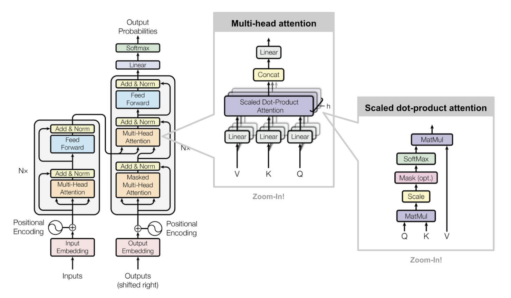
> Figure 7 The Transformer architecture

Here is the complete view of the Transformer's architecture:

- Both the source and target sequences first go through embedding layers to produce data of the same dimension _dmodel_ = 512.

- To preserve the position information, a sinusoid-wave-based positional encoding is applied and summed with the embedding output. Here, sinusoidal positional encoding is a vector of small values (constants) added to the embeddings. As a result, the same word will have slightly different embeddings depending on where they occur in the sentence.

- A softmax and linear layer are added to the final decoder output.

### Why Transformers succeed

Transformers succeed mainly because of two key reasons:

1. The self-attention mechanism allows encoding long-range dependencies.

2. The inherent self-supervision of the architecture allows leveraging large unlabeled datasets, which spans most real-world datasets.